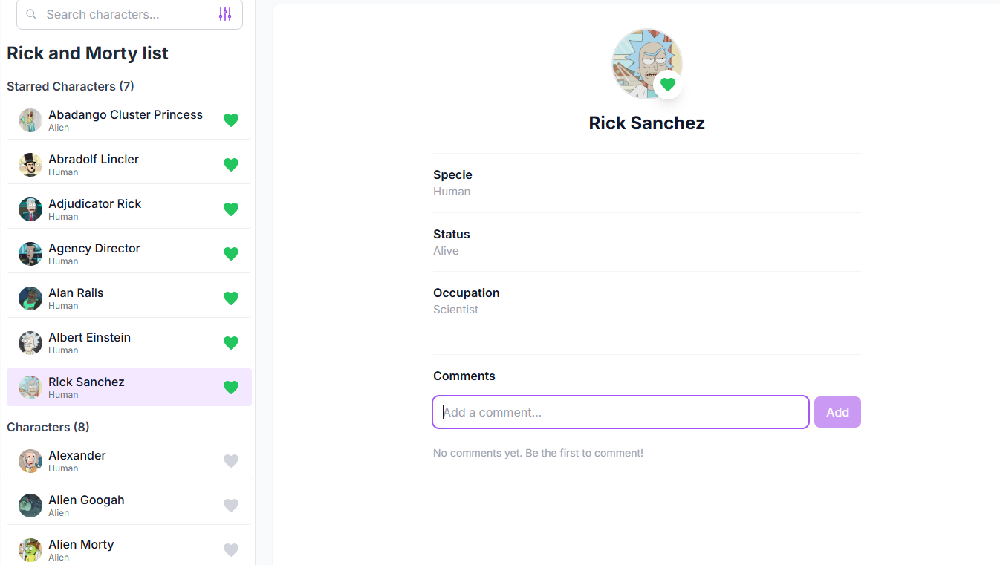

# Rick and Morty Character App

Una aplicación fullstack moderna construida con React 18, GraphQL, Express y bases de datos relacionales para explorar personajes de Rick and Morty.



## 🚀 Stack Tecnológico

### Frontend
- **React 18** - Biblioteca UI con hooks y características concurrentes
- **GraphQL** - Lenguaje de consulta de datos con Apollo Client
- **TypeScript** - Seguridad de tipos y mejor experiencia de desarrollo
- **Vite** - Herramienta de build rápida y servidor de desarrollo
- **Tailwind CSS** - Framework CSS utility-first
- **React Testing Library** - Testing de componentes
- **Jest** - Framework de testing unitario

### Backend
- **Node.js** - Runtime de JavaScript
- **Express** - Framework web
- **GraphQL** - API con Apollo Server
- **PostgreSQL** - Base de datos relacional
- **Prisma** - ORM de base de datos
- **Redis** - Capa de caché
- **JWT** - Autenticación
- **Jest** - Framework de testing unitario

## 📁 Estructura del Proyecto

```
Prueba/
├── frontend/                 # Aplicación React
│   ├── src/
│   │   ├── components/      # Componentes reutilizables
│   │   ├── pages/          # Componentes de página
│   │   ├── hooks/          # Custom React hooks
│   │   ├── graphql/        # Queries y mutations GraphQL
│   │   └── tests/          # Archivos de test
│   └── package.json
├── backend/                 # Servidor Express + GraphQL
│   ├── src/
│   │   ├── graphql/        # Resolvers GraphQL
│   │   ├── middleware/     # Middleware Express
│   │   ├── utils/          # Funciones utilitarias
│   │   └── tests/          # Archivos de test
│   ├── prisma/             # Schema y migraciones de BD
│   ├── docker-init.sh      # Script de inicialización Docker
│   └── package.json
├── docker-compose.yml       # Configuración Docker
├── run-backend-docker.sh    # Script para ejecutar backend con Docker (macOS/Linux)
├── run-windows.bat          # Script para Windows (CMD)
├── run-windows.ps1          # Script para Windows (PowerShell)
└── README.md
```

## 🛠️ Instrucciones de Configuración

### Prerrequisitos
- Node.js 18+ 
- npm 9+
- Docker Desktop
- PostgreSQL (opcional, se incluye en Docker)
- Redis (opcional, se incluye en Docker)

### 🪟 Instalación en Windows

#### Opción 1: Docker Compose (Recomendado)
```cmd
# Usando CMD
run-windows.bat

# O usando PowerShell
.\run-windows.ps1
```

#### Opción 2: Docker Compose Manual
```cmd
# Detener contenedores existentes
docker-compose down

# Iniciar todos los servicios
docker-compose up -d

# Ver logs
docker-compose logs -f
```

#### Opción 3: Instalación Tradicional
```cmd
# Clonar el repositorio
git clone https://github.com/Alejandro2097/Rick-and-Morty
cd Prueba

# Configurar variables de entorno
copy backend\env.example backend\.env
copy frontend\env.example frontend\.env

# Instalar dependencias
cd backend
npm install
npx prisma generate
npx prisma migrate dev
npx prisma db seed
npm run dev

# En otra terminal
cd frontend
npm install
npm run dev
```

### 🐧 Instalación en macOS/Linux

#### Opción 1: Docker Compose (Recomendado)
```bash
# Configurar Docker/Colima (macOS)
chmod +x setup-colima.sh
./setup-colima.sh

# Ejecutar con Docker
chmod +x run-backend-docker.sh
./run-backend-docker.sh
```

#### Opción 2: Instalación Tradicional
```bash
# Clonar el repositorio
git clone <repository-url>
cd Prueba

# Configurar el proyecto
chmod +x setup.sh
./setup.sh

# Configurar variables de entorno
cp backend/env.example backend/.env
cp frontend/env.example frontend/.env

# Configurar la base de datos
cd backend
npx prisma generate
npx prisma migrate dev
npx prisma db seed

# Ejecutar el proyecto
npm run dev

# En otra terminal
cd frontend
npm run dev
```

## 🧪 Testing

```bash
# Ejecutar tests del frontend
cd frontend
npm test

# Ejecutar tests del backend
cd backend
npm test
```

## 📦 Build

```bash
# Build del frontend
cd frontend
npm run build

# Build del backend
cd backend
npm run build
```

## 🐳 Docker

### Windows
```cmd
# Ejecutar todo automáticamente
run-windows.bat

# O con PowerShell
.\run-windows.ps1

# Manual
docker-compose up -d
```

### macOS/Linux
```bash
# Ejecutar todo automáticamente
./run-backend-docker.sh

# Manual
docker-compose up -d
```

### Comandos útiles de Docker
```bash
# Detener todos los contenedores
docker-compose down

# Ver logs de un servicio específico
docker-compose logs -f backend
docker-compose logs -f postgres

# Acceder al contenedor de la base de datos
docker-compose exec postgres psql -U postgres -d fullstack_app

# Repoblar la base de datos
docker-compose run --rm backend npx prisma db seed

# Ver estado de los servicios
docker-compose ps
```

## 🔧 Scripts de Desarrollo

### Frontend
- `npm run dev` - Iniciar servidor de desarrollo (puerto 5173)
- `npm run build` - Build para producción
- `npm test` - Ejecutar tests

### Backend
- `npm run dev` - Iniciar servidor de desarrollo (puerto 4000)
- `npm run build` - Build para producción
- `npm test` - Ejecutar tests
- `npm run db:seed` - Poblar base de datos manualmente

## 📚 Documentación de la API

La API GraphQL está disponible en `http://localhost:4000/graphql` con un playground interactivo para probar queries y mutations.

### Principales Queries:
- `GetCharacters` - Obtener lista de personajes con filtros
- `GetCharacter` - Obtener detalles de un personaje específico

### Principales Mutations:
- `ToggleStarCharacter` - Marcar/desmarcar personaje como favorito
- `AddComment` - Agregar comentario a un personaje
- `DeleteComment` - Eliminar comentario

## 🎨 Características de la Aplicación

- **Búsqueda de personajes** - Buscar por nombre
- **Filtros** - Filtrar por especie y estado de favorito
- **Favoritos** - Marcar personajes como favoritos
- **Comentarios** - Agregar comentarios a personajes
- **Diseño responsive** - Funciona en móvil y desktop
- **UI moderna** - Diseño inspirado en Figma

## 🚨 Solución de Problemas

### Windows
- **Docker no inicia**: Asegúrate de que Docker Desktop esté ejecutándose
- **Puertos ocupados**: Verifica que los puertos 4000, 5173, 5432 y 6379 estén libres
- **Permisos**: Ejecuta PowerShell como administrador si hay problemas de permisos

### macOS/Linux
- **Colima no funciona**: Ejecuta `colima start` manualmente
- **Permisos de archivos**: Ejecuta `chmod +x *.sh` para dar permisos a los scripts

### General
- **Base de datos no se puebla**: Ejecuta `docker-compose run --rm backend npx prisma db seed`
- **Contenedores no inician**: Verifica que Docker tenga suficiente memoria (mínimo 4GB)

## 🤝 Contribuir

1. Fork el repositorio
2. Crear una rama de feature
3. Hacer los cambios
4. Agregar tests para nueva funcionalidad
5. Ejecutar la suite de tests
6. Enviar un pull request

## 📄 Licencia

Este proyecto está licenciado bajo la Licencia MIT. 